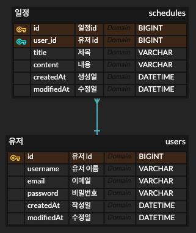

# Schedule Develop

## 프로젝트 소개

Spring Boot와 JPA를 활용하여 유저와 일정을 관리하는 REST API 프로젝트입니다.

로그인한 유저는 Cookie / Session 인증을 통해 본인의 일정을 생성, 수정, 삭제할 수 있습니다.

---

## 개발 환경

- Java 17
- Spring Boot
- Spring Data JPA
- Cookie / Session
- MySQL
- Gradle
- IntelliJ, Postman, Git

---

## ERD



### 테이블 관계

- 유저 1명은 여러 개의 일정을 작성할 수 있습니다.
- 일정 1개는 반드시 1명의 유저에 속합니다.
- `schedules.user_id`는 `users.id`를 참조합니다.
- 로그인 이후 일정 생성 시 요청값으로 `userId`를 받지 않고, 세션에 저장된 로그인 유저 정보를 사용합니다.

---

## 프로젝트 구조

```bash
src/main/java/com/example/scheduledevelop
├── auth
│   ├── controller
│   ├── dto
│   └── service
├── basic
│   ├── controller
│   ├── entity
│   └── SessionValue.java
├── schedule
│   ├── controller
│   ├── dto
│   ├── entity
│   ├── repository
│   └── service
├── user
│   ├── controller
│   ├── dto
│   ├── entity
│   ├── repository
│   └── service
└── ScheduleDevelopApplication.java
```

---

## 구현 기능

- 유저 CRUD
- 회원가입
- 로그인 / 로그아웃
- Cookie / Session 기반 인증
- 일정 CRUD
- 유저와 일정의 연관관계
- JPA Auditing을 활용한 생성일 / 수정일 관리

---

## API 명세서

### 공통 정보

| 항목 | 내용 |
| --- | --- |
| Base URL | `http://localhost:8080` |
| 데이터 형식 | JSON |
| 인증 방식 | Cookie / Session |
| 세션 쿠키 | 로그인 성공 후 발급되는 `JSESSIONID` |

### 공통 실패 응답 형식

```json
{
  "status": 401,
  "message": "로그인이 필요한 작업입니다."
}
```

| 상태 코드 | 메시지 예시 | 설명 |
| --- | --- | --- |
| `400 Bad Request` | `비밀번호는 8글자 이상이어야 합니다.` | 요청 값이 올바르지 않은 경우 |
| `401 Unauthorized` | `로그인이 필요한 작업입니다.` | 로그인하지 않고 인증이 필요한 API를 호출한 경우 |
| `403 Forbidden` | `본인 정보만 수정 가능합니다.` | 로그인했지만 해당 리소스에 대한 권한이 없는 경우 |
| `404 Not Found` | `존재하지 않는 유저입니다.` | 요청한 데이터가 존재하지 않는 경우 |

---

<details>
<summary>유저 API</summary>

## 1. 유저 생성 API

| 항목 | 내용 |
| --- | --- |
| URL | `/user` |
| Method | `POST` |
| 설명 | 유저를 생성하는 API입니다. 회원가입 기능으로 사용합니다. |
| 인증 | 불필요 |

### Request Headers

| 이름 | 데이터 타입 | 설명 |
| --- | --- | --- |
| Content-Type | String | `application/json` 고정 |

### Request Body

```json
{
  "username": "yejin",
  "email": "yejin@example.com",
  "password": "12345678"
}
```

| 이름 | 데이터 타입 | 필수 여부 | 설명 |
| --- | --- | --- | --- |
| username | String | 필수 | 유저명 |
| email | String | 필수 | 이메일 |
| password | String | 필수 | 비밀번호, 8자 이상 |

### Response Body

```json
{
  "id": 1,
  "username": "yejin",
  "email": "yejin@example.com",
  "createdAt": "2026-04-20T11:20:00",
  "modifiedAt": "2026-04-20T11:20:00"
}
```

### 성공 응답

| 상태 코드 | 메시지 | 설명 |
| --- | --- | --- |
| `201 Created` | - | 유저 생성 성공 |

### 실패 응답

| 상태 코드 | 메시지 | 설명 |
| --- | --- | --- |
| `400 Bad Request` | `비밀번호는 8글자 이상이어야 합니다.` | 비밀번호가 8자 미만인 경우 |

---

## 2. 유저 전체 조회 API

| 항목 | 내용 |
| --- | --- |
| URL | `/user` |
| Method | `GET` |
| 설명 | 전체 유저 목록을 조회하는 API입니다. |
| 인증 | 불필요 |

### Response Body

```json
[
  {
    "id": 1,
    "username": "yejin",
    "email": "yejin@example.com",
    "createdAt": "2026-04-20T11:20:00",
    "modifiedAt": "2026-04-20T11:20:00"
  }
]
```

### 성공 응답

| 상태 코드 | 메시지 | 설명 |
| --- | --- | --- |
| `200 OK` | - | 유저 전체 조회 성공 |

### 실패 응답

| 상태 코드 | 메시지 | 설명 |
| --- | --- | --- |
| - | - | 별도 실패 응답 없음 |

---

## 3. 유저 단건 조회 API

| 항목 | 내용 |
| --- | --- |
| URL | `/user/{userId}` |
| Method | `GET` |
| 설명 | 유저 ID로 특정 유저를 조회하는 API입니다. |
| 인증 | 불필요 |

### Path Variable

| 이름 | 데이터 타입 | 설명 |
| --- | --- | --- |
| userId | Long | 조회할 유저 ID |

### Response Body

```json
{
  "id": 1,
  "username": "yejin",
  "email": "yejin@example.com",
  "createdAt": "2026-04-20T11:20:00",
  "modifiedAt": "2026-04-20T11:20:00"
}
```

### 성공 응답

| 상태 코드 | 메시지 | 설명 |
| --- | --- | --- |
| `200 OK` | - | 유저 단건 조회 성공 |

### 실패 응답

| 상태 코드 | 메시지 | 설명 |
| --- | --- | --- |
| `404 Not Found` | `존재하지 않는 유저입니다.` | 해당 ID의 유저가 존재하지 않는 경우 |

---

## 4. 유저 수정 API

| 항목 | 내용 |
| --- | --- |
| URL | `/user/{userId}` |
| Method | `PATCH` |
| 설명 | 로그인한 유저가 본인의 정보를 수정하는 API입니다. |
| 인증 | 필요 |

### Request Headers

| 이름 | 데이터 타입 | 설명 |
| --- | --- | --- |
| Content-Type | String | `application/json` 고정 |
| Cookie | String | 로그인 후 발급받은 `JSESSIONID` |

### Path Variable

| 이름 | 데이터 타입 | 설명 |
| --- | --- | --- |
| userId | Long | 수정할 유저 ID |

### Request Body

```json
{
  "username": "yejin-update",
  "email": "yejin-update@example.com",
  "password": "12345678"
}
```

| 이름 | 데이터 타입 | 필수 여부 | 설명 |
| --- | --- | --- | --- |
| username | String | 필수 | 수정할 유저명 |
| email | String | 필수 | 수정할 이메일 |
| password | String | 필수 | 수정할 비밀번호 |

### Response Body

```json
{
  "id": 1,
  "username": "yejin-update",
  "email": "yejin-update@example.com",
  "createdAt": "2026-04-20T11:20:00",
  "modifiedAt": "2026-04-20T12:00:00"
}
```

### 성공 응답

| 상태 코드 | 메시지 | 설명 |
| --- | --- | --- |
| `200 OK` | - | 유저 정보 수정 성공 |

### 실패 응답

| 상태 코드 | 메시지 | 설명 |
| --- | --- | --- |
| `401 Unauthorized` | `로그인이 필요한 작업입니다.` | 로그인하지 않은 경우 |
| `403 Forbidden` | `본인 정보만 수정 가능합니다.` | 다른 유저의 정보를 수정하려는 경우 |
| `404 Not Found` | `존재하지 않는 유저입니다.` | 수정할 유저가 존재하지 않는 경우 |

---

## 5. 유저 삭제 API

| 항목 | 내용 |
| --- | --- |
| URL | `/user/{userId}` |
| Method | `DELETE` |
| 설명 | 로그인한 유저가 본인의 계정을 삭제하는 API입니다. |
| 인증 | 필요 |

### Request Headers

| 이름 | 데이터 타입 | 설명 |
| --- | --- | --- |
| Cookie | String | 로그인 후 발급받은 `JSESSIONID` |

### Path Variable

| 이름 | 데이터 타입 | 설명 |
| --- | --- | --- |
| userId | Long | 삭제할 유저 ID |

### 성공 응답

| 상태 코드 | 메시지 | 설명 |
| --- | --- | --- |
| `204 No Content` | - | 유저 삭제 성공 |

### 실패 응답

| 상태 코드 | 메시지 | 설명 |
| --- | --- | --- |
| `401 Unauthorized` | `로그인이 필요한 작업입니다.` | 로그인하지 않은 경우 |
| `403 Forbidden` | `본인만 삭제 가능합니다.` | 다른 유저를 삭제하려는 경우 |
| `404 Not Found` | `존재하지 않는 유저입니다.` | 삭제할 유저가 존재하지 않는 경우 |

</details>

---

<details>
<summary>인증 API</summary>

## 1. 로그인 API

| 항목 | 내용 |
| --- | --- |
| URL | `/users/login` |
| Method | `POST` |
| 설명 | 이메일과 비밀번호로 로그인하는 API입니다. 로그인 성공 시 세션이 생성됩니다. |
| 인증 | 불필요 |

### Request Headers

| 이름 | 데이터 타입 | 설명 |
| --- | --- | --- |
| Content-Type | String | `application/json` 고정 |

### Request Body

```json
{
  "email": "yejin@example.com",
  "password": "12345678"
}
```

| 이름 | 데이터 타입 | 필수 여부 | 설명 |
| --- | --- | --- | --- |
| email | String | 필수 | 로그인 이메일 |
| password | String | 필수 | 로그인 비밀번호 |

### Response Headers

| 이름 | 설명 |
| --- | --- |
| Set-Cookie | 로그인 성공 시 `JSESSIONID`가 발급됩니다. |

### Response Body

```json
{
  "userId": 1,
  "username": "yejin",
  "email": "yejin@example.com",
  "message": "로그인 성공"
}
```

### 성공 응답

| 상태 코드 | 메시지 | 설명 |
| --- | --- | --- |
| `200 OK` | `로그인 성공` | 로그인 성공 및 세션 생성 |

### 실패 응답

| 상태 코드 | 메시지 | 설명 |
| --- | --- | --- |
| `401 Unauthorized` | `존재하지 않는 유저입니다.` | 가입되지 않은 이메일로 로그인한 경우 |
| `401 Unauthorized` | `비밀번호가 일치하지 않습니다.` | 비밀번호가 일치하지 않는 경우 |

---

## 2. 로그아웃 API

| 항목 | 내용 |
| --- | --- |
| URL | `/users/logout` |
| Method | `POST` |
| 설명 | 현재 로그인 세션을 만료시키는 API입니다. |
| 인증 | 필요 |

### Request Headers

| 이름 | 데이터 타입 | 설명 |
| --- | --- | --- |
| Cookie | String | 로그인 후 발급받은 `JSESSIONID` |

### 성공 응답

| 상태 코드 | 메시지 | 설명 |
| --- | --- | --- |
| `204 No Content` | - | 로그아웃 성공 및 세션 만료 |

### 실패 응답

| 상태 코드 | 메시지 | 설명 |
| --- | --- | --- |
| `400 Bad Request` | `로그인 상태가 아닙니다.` | 로그인하지 않은 상태에서 로그아웃을 요청한 경우 |

</details>

---

<details>
<summary>일정 API</summary>

## 1. 일정 생성 API

| 항목 | 내용 |
| --- | --- |
| URL | `/schedules` |
| Method | `POST` |
| 설명 | 로그인한 유저가 일정을 생성하는 API입니다. |
| 인증 | 필요 |

### Request Headers

| 이름 | 데이터 타입 | 설명 |
| --- | --- | --- |
| Content-Type | String | `application/json` 고정 |
| Cookie | String | 로그인 후 발급받은 `JSESSIONID` |

### Request Body

```json
{
  "title": "과제",
  "content": "일정 CRUD 구현"
}
```

| 이름 | 데이터 타입 | 필수 여부 | 설명 |
| --- | --- | --- | --- |
| title | String | 필수 | 일정 제목 |
| content | String | 필수 | 일정 내용 |

### Response Body

```json
{
  "id": 1,
  "username": "yejin",
  "title": "과제",
  "content": "일정 CRUD 구현",
  "createdAt": "2026-04-20T11:20:00",
  "modifiedAt": "2026-04-20T11:20:00"
}
```

### 성공 응답

| 상태 코드 | 메시지 | 설명 |
| --- | --- | --- |
| `201 Created` | - | 일정 생성 성공 |

### 실패 응답

| 상태 코드 | 메시지 | 설명 |
| --- | --- | --- |
| `401 Unauthorized` | `로그인이 필요한 작업입니다.` | 로그인하지 않은 경우 |
| `404 Not Found` | `존재하지 않는 유저입니다.` | 세션에 저장된 유저 ID가 존재하지 않는 경우 |

---

## 2. 일정 전체 조회 API

| 항목 | 내용 |
| --- | --- |
| URL | `/schedules` |
| Method | `GET` |
| 설명 | 전체 일정 목록을 조회하는 API입니다. |
| 인증 | 불필요 |

### Response Body

```json
{
  "scheduleGetResponsesList": [
    {
      "id": 1,
      "username": "yejin",
      "title": "과제",
      "content": "일정 CRUD 구현",
      "createdAt": "2026-04-20T11:20:00",
      "modifiedAt": "2026-04-20T11:20:00"
    }
  ]
}
```

### 성공 응답

| 상태 코드 | 메시지 | 설명 |
| --- | --- | --- |
| `200 OK` | - | 일정 전체 조회 성공 |

### 실패 응답

| 상태 코드 | 메시지 | 설명 |
| --- | --- | --- |
| - | - | 별도 실패 응답 없음 |

---

## 3. 일정 단건 조회 API

| 항목 | 내용 |
| --- | --- |
| URL | `/schedules/{scheduleId}` |
| Method | `GET` |
| 설명 | 일정 ID로 특정 일정을 조회하는 API입니다. |
| 인증 | 불필요 |

### Path Variable

| 이름 | 데이터 타입 | 설명 |
| --- | --- | --- |
| scheduleId | Long | 조회할 일정 ID |

### Response Body

```json
{
  "id": 1,
  "username": "yejin",
  "title": "과제",
  "content": "일정 CRUD 구현",
  "createdAt": "2026-04-20T11:20:00",
  "modifiedAt": "2026-04-20T11:20:00"
}
```

### 성공 응답

| 상태 코드 | 메시지 | 설명 |
| --- | --- | --- |
| `200 OK` | - | 일정 단건 조회 성공 |

### 실패 응답

| 상태 코드 | 메시지 | 설명 |
| --- | --- | --- |
| `404 Not Found` | `존재하지 않는 일정입니다.` | 해당 ID의 일정이 존재하지 않는 경우 |

---

## 4. 일정 수정 API

| 항목 | 내용 |
| --- | --- |
| URL | `/schedules/{scheduleId}` |
| Method | `PATCH` |
| 설명 | 로그인한 유저가 본인이 작성한 일정을 수정하는 API입니다. |
| 인증 | 필요 |

### Request Headers

| 이름 | 데이터 타입 | 설명 |
| --- | --- | --- |
| Content-Type | String | `application/json` 고정 |
| Cookie | String | 로그인 후 발급받은 `JSESSIONID` |

### Path Variable

| 이름 | 데이터 타입 | 설명 |
| --- | --- | --- |
| scheduleId | Long | 수정할 일정 ID |

### Request Body

```json
{
  "title": "과제 수정",
  "content": "일정 CRUD 수정 구현"
}
```

| 이름 | 데이터 타입 | 필수 여부 | 설명 |
| --- | --- | --- | --- |
| title | String | 필수 | 수정할 일정 제목 |
| content | String | 필수 | 수정할 일정 내용 |

### Response Body

```json
{
  "id": 1,
  "username": "yejin",
  "title": "과제 수정",
  "content": "일정 CRUD 수정 구현",
  "createdAt": "2026-04-20T11:20:00",
  "modifiedAt": "2026-04-20T12:00:00"
}
```

### 성공 응답

| 상태 코드 | 메시지 | 설명 |
| --- | --- | --- |
| `200 OK` | - | 일정 수정 성공 |

### 실패 응답

| 상태 코드 | 메시지 | 설명 |
| --- | --- | --- |
| `401 Unauthorized` | `로그인이 필요한 작업입니다.` | 로그인하지 않은 경우 |
| `403 Forbidden` | `작성한 유저만 수정할 수 있습니다.` | 다른 유저의 일정을 수정하려는 경우 |
| `404 Not Found` | `존재하지 않는 일정입니다.` | 수정할 일정이 존재하지 않는 경우 |

---

## 5. 일정 삭제 API

| 항목 | 내용 |
| --- | --- |
| URL | `/schedules/{scheduleId}` |
| Method | `DELETE` |
| 설명 | 로그인한 유저가 본인이 작성한 일정을 삭제하는 API입니다. |
| 인증 | 필요 |

### Request Headers

| 이름 | 데이터 타입 | 설명 |
| --- | --- | --- |
| Cookie | String | 로그인 후 발급받은 `JSESSIONID` |

### Path Variable

| 이름 | 데이터 타입 | 설명 |
| --- | --- | --- |
| scheduleId | Long | 삭제할 일정 ID |

### 성공 응답

| 상태 코드 | 메시지 | 설명 |
| --- | --- | --- |
| `204 No Content` | - | 일정 삭제 성공 |

### 실패 응답

| 상태 코드 | 메시지 | 설명 |
| --- | --- | --- |
| `401 Unauthorized` | `로그인이 필요한 작업입니다.` | 로그인하지 않은 경우 |
| `403 Forbidden` | `작성한 유저만 삭제할 수 있습니다.` | 다른 유저의 일정을 삭제하려는 경우 |
| `404 Not Found` | `존재하지 않는 일정입니다.` | 삭제할 일정이 존재하지 않는 경우 |

</details>
